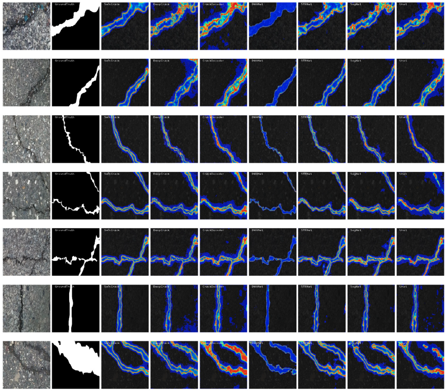

# CrackLab for Crack Segmentation 

This is a framework supporting training, inferece, and evaluation of a wide range of the pavement crack segmentation networks, including: crackformer, crack seg, deepcrack, deeplab, DMANet, LETNet, SDDNet, SegNetm STRNet, UNet, and so on.

<div style="text-align: center;">
    
</div>


## Installation

- create env
```Shell
# CUDA version =11.8
conda create -n cracklab python==3.9
conda activate cracklab
pip install -r -requirements
```

- install deformable convolution
```
cd nets/ops_dcnv3
sh ./make.sh
# unit test (should see all checking is True)
python test.py

```
## Data Preparation
- Prepare your data set in the following file structure:
```
dataset/
│
├── imgdir/
│   ├── img1.png
│   │
│   └── img2.png
│
└── maskdir/
    ├── mask1.png
    │
    └── mask2.png
```
- Generating file txt using [txt_generator](tools/txt_generator.py)
- Modify the name, gpu_id, train_data_path, val_data_path, and test_data_path in the [config](config/config_deepcrack.py). The train_data_path, val_data_path, and test_data_path is the path to the generated text file in the last step.


## Quick Start

```Shell
# training:
python train.py --name <the name of the model to be trained>

# inference:
#1.  Modify the "net_name" and "model_path" in the "inference.py" file then:
python inference.py
```

## Highlight 
- CrackLab supports a wide range of crack segmentation network, all the supported network can be seen from the names of the config files under the config directory, including: crackformer, crack seg, deepcrack, deeplab, DMANet, LETNet, SDDNet, SegNetm STRNet, UNet.
- [Tools](tools) for Metric calculation, curve plot, and evluations are provided, remaining to be explored.

## Citation

If you find our work useful, please consider citing:

```
@article{RN492,
   author = {Wang, Cheng and Liu, Haibing and An, Xiaoya and Gong, Zhiqun and Deng, Fei},
   title = {SwinCrack: Pavement crack detection using convolutional swin-transformer network},
   journal = {Digital Signal Processing},
   volume = {145},
   pages = {104297},
   ISSN = {1051-2004},
   year = {2024},
   type = {Journal Article}
}

@article{RN490,
   author = {Wang, Cheng and Liu, Haibing and An, Xiaoya and Gong, Zhiqun and Deng, Fei},
   title = {DCNCrack: Pavement Crack Segmentation Based on Large-Scaled Deformable Convolutional Network},
   journal = {Journal of Computing in Civil Engineering},
   volume = {39},
   number = {2},
   pages = {04025009},
   ISSN = {0887-3801},
   year = {2025},
   type = {Journal Article}
}

```

## Acknowledgements

https://github.com/qinnzou/DeepCrack
